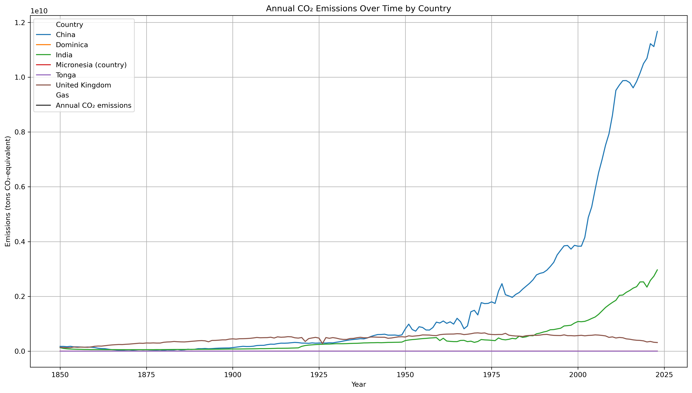
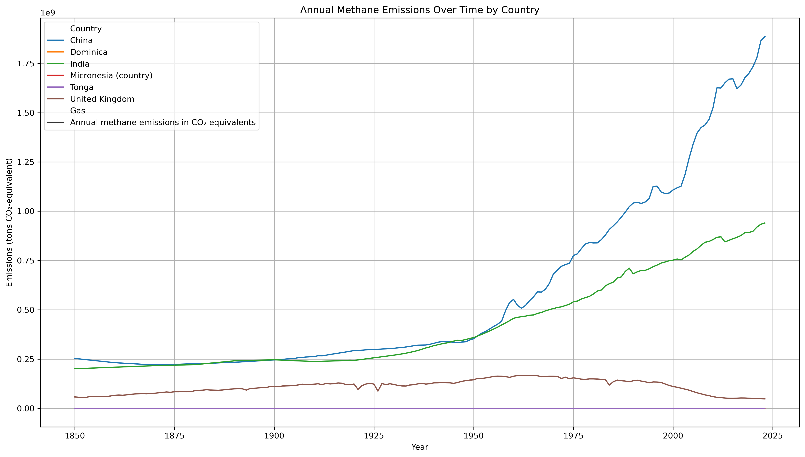
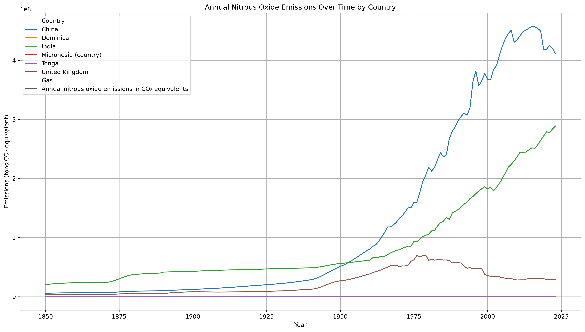
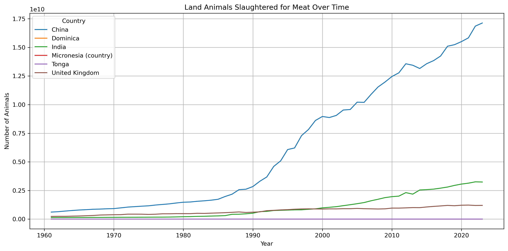
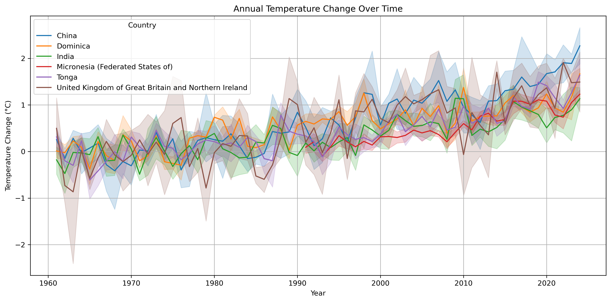
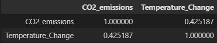
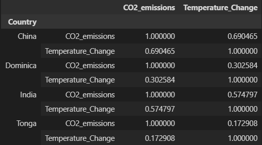
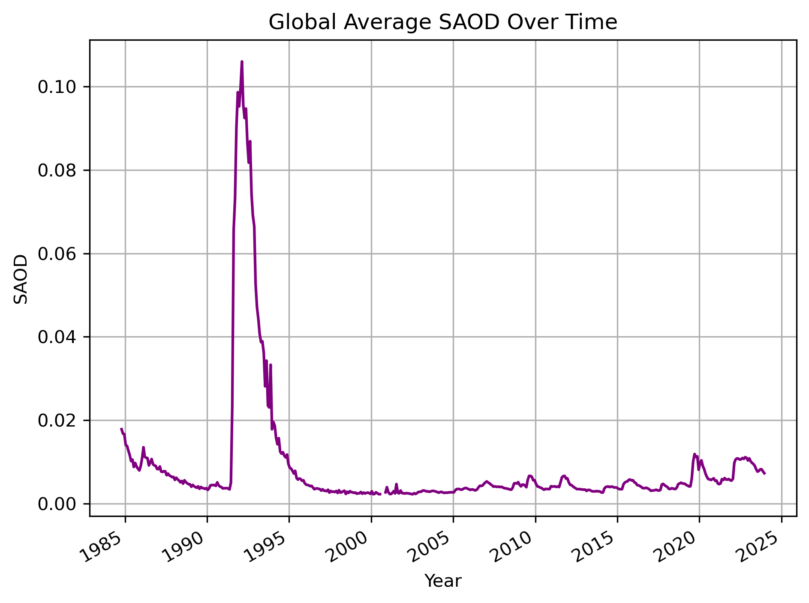
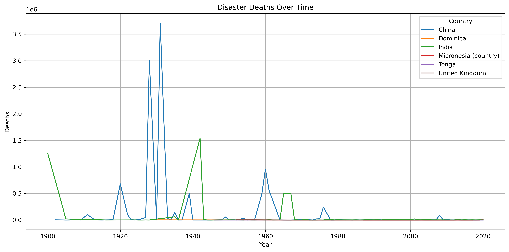
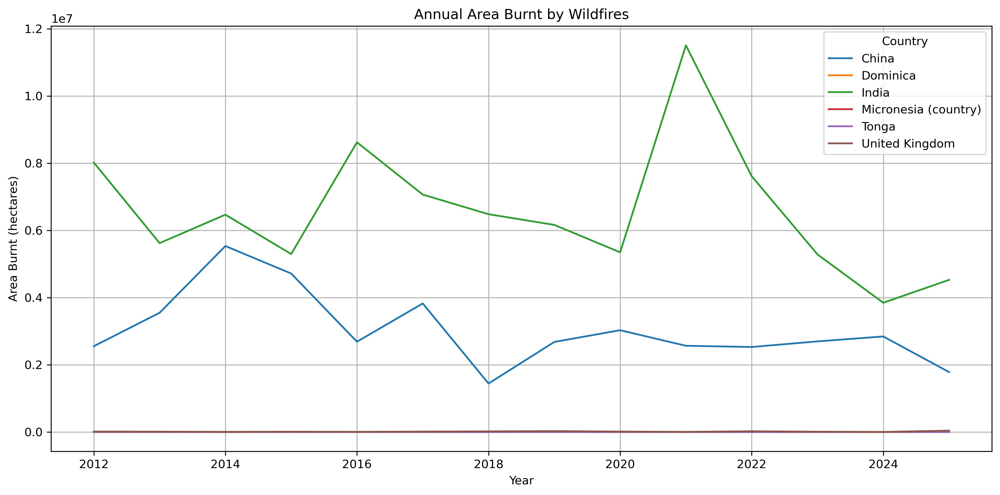

# Global Warming: Human Influence Outweighs Natural Causes  

##  INTRODUCTION
Global warming is one of the most pressing challenges of the 21st century. But is it primarily caused by human activity?  
This study investigates the connection between **human-generated greenhouse gas (GHG) emissions** and **temperature changes** over time, while also evaluating the potential role of **natural factors** such as volcanic activity.  

We compared data from **six countries**:  
- High-emission, industrialized nations: **China, India, United Kingdom**  
- Low-emission island nations: **Micronesia, Dominica, Tonga**  

The results highlight how human intervention is the primary driver of global warming.  

---

##  AUTHORS  
- [@Davin V Jobin](https://github.com/davinvadakkethonikuzhiyiljobin) 
- [@Emma Thomas](https://github.com/Emma-Thomas-24209270)

---
---
## OBJECTIVE:
The objective of this project is to comprehensively evaluate the drivers of global warming by integrating multi-country datasets on greenhouse gas emissions, temperature changes, and natural climate influences. Specifically, this study seeks to:
1.	Analyse historical and contemporary trends in key greenhouse gases (CO₂, methane, and nitrous oxide) and evaluate their relationship with rising global temperatures.
2.	Investigate the role of natural factors such as volcanic aerosols in explaining short-term climate variability, while distinguishing them from long-term human-driven warming trends.
3.	Assess the contribution of wildfires both as an impact of global warming (driven by increasing temperatures and prolonged dry seasons) and as an additional source of GHG emissions that further intensify warming.
4.	Compare the warming trajectories of high-emission nations (e.g., China, India, UK) and low-emission nations (e.g., Tonga, Dominica, Micronesia) to highlight inequities in climate impacts.
5.	Provide evidence to strengthen the understanding of global warming’s primary drivers and inform policies aimed at mitigating emissions and supporting vulnerable nations.
Ultimately, the project aims to show that while short-term variations may arise from natural processes, the persistent upward trend in global temperatures is overwhelmingly driven by human activity, with wildfires acting as a compounding impact-and-cause feedback mechanism. This underscores the urgency of reducing emissions and building resilience against climate impacts.

---

# SECTION 1: 
## GREENHOUSE GASES  

## CO₂ EMISSIONS  
Carbon dioxide (CO₂) is the most common greenhouse gas produced by humans. It mainly comes from burning coal, oil, and gas for electricity, transport, and industry, as well as from cutting down trees. What makes CO₂ so harmful is that it stays in the atmosphere for hundreds of years, keeping the Earth warm long after it’s released.

  

1. China (blue):
China’s emissions remained low until around the 1950s. After that, they started rising, and from the 2000s onwards, they shot up very quickly. Today, China is the world’s biggest emitter of CO₂, producing over 11 billion tons a year. This huge increase is linked to China’s fast industrial growth, growing cities, and heavy use of coal. It clearly shows how human activities can cause sharp increases in greenhouse gas emissions.

2. India (green):
India also started with low emissions. From the 1950s onwards, emissions slowly grew, and then picked up more speed after 1990. By 2025, India’s emissions are expected to reach around 2.5 to 3 billion tons a year. This growth is due to the country’s large population, growing need for electricity, and farming. It shows how human development and energy use directly affect CO₂ levels.

3. United Kingdom (brown):
The UK has a different pattern. Its emissions started rising very early in the 1800s during the industrial revolution. But since the 1970s, the UK’s emissions have dropped steadily. This is because the country moved towards cleaner energy, better technology, and strong climate policies. The UK shows us that it's possible to reduce emissions while still growing the economy.

4. Tonga / Dominica / Micronesia (pink/purple/orange):
These small island nations have contributed almost nothing to global CO₂ emissions. Their emission levels have stayed flat and near zero. Yet, they are among the first to feel the effects of climate change like rising sea levels and stronger storms. This is a clear example of climate injustice: countries that pollute the least are often the most affected.

Carbon dioxide (CO₂) is the largest contributor to anthropogenic climate change, primarily released through fossil fuel combustion, deforestation, and industrial activities. It is the most abundant long-lived greenhouse gas, remaining in the atmosphere for centuries and acting as the primary driver of sustained global warming. Our analysis shows steep increases in CO₂ emissions from industrializing nations such as China and India, especially after the 1950s, with China now the dominant global emitter. The United Kingdom, while historically one of the highest emitters, has seen emissions steadily decline since the 1970s due to policy shifts and a transition away from coal. Small island nations such as Tonga, Dominica, and Micronesia remain negligible contributors throughout the period. The plot reveals that China exhibits exponential growth in emissions beginning in the 1980s, while India follows a steadier upward trajectory. By contrast, the UK shows a clear downward path, reflecting decarbonization efforts. The sustained rise in emissions from emerging economies directly parallels their industrial and economic growth, strongly supporting the case that global warming is primarily driven by human activity rather than natural variability.

## CH₄ EMISSIONS
Methane (CH₄) is one of the most powerful greenhouse gases, trapping over 25 times more heat than carbon dioxide over a century. The key human sources include, livestock farming, rice cultivation, landfills, and the oil and gas industry
  

1. China (blue line):
China’s methane emissions stayed relatively stable until the mid-20th century. From the 1950s onwards, however, they began to climb rapidly, accelerating especially after 1980 and surging again after 2000. By 2025, China is releasing nearly 1.9 billion tons of CO₂-equivalent methane every year. This dramatic increase mirrors the country’s growth in livestock production, rice farming, fossil fuel extraction, and waste generation. China’s trend is a clear example of how intensified human activity drives methane emissions at the national scale.

2. India (green line):
India’s methane emissions have been high for centuries, reflecting its long reliance on agriculture and livestock. From 1850 to 1950, the growth is moderate, but after 1970, emissions rise steeply. By 2025, India produces more than 1 billion tons of CO₂-equivalent methane annually. The primary sources are agricultural particularly cattle rearing and flooded rice paddies. This long-term pattern highlights the strong human link between agricultural practices and methane output.

3. United Kingdom (brown line):
Methane emissions in the UK show a gradual increase from 1850 to around 1990, followed by a clear and sustained decline. By 2025, the UK’s emissions fall below 0.1 billion tons CO₂-equivalent. This reduction is largely due to improved livestock management, better landfill practices, and reduced coal mining. The UK’s progress shows that deliberate policies can meaningfully cut methane emission.

4. Tonga, Dominica, Micronesia (pink, orange, purple — nearly flat lines):
For these small island countries, methane emissions have remained flat and close to zero across the entire period. Due to minimal industrial activity and limited livestock agriculture, their methane outputs are negligible. However, despite their low contributions, these countries still experience the damaging effects of climate change. Their situation underscores the disproportionate burden faced by low-emission nations due to emissions generated elsewhere.

China and India show consistent growth in methane emissions, with a marked acceleration after the 1970s driven by agricultural expansion, livestock farming, and waste sector development. The United Kingdom, in contrast, demonstrates a steady decline in emissions after the 1990s, reflecting the success of regulatory measures and improved management practices. Small island nations contribute only negligible amounts of methane, yet remain among the most vulnerable to its warming effects, underscoring the disproportionate burden on low-emission countries. Overall, these trends highlight how human-driven agricultural and industrial activities are key contributors to rising methane levels and global warming.

## N₂O EMISSIONS
N₂O (nitrous oxide) is a potent greenhouse gas: ~298× more powerful than CO₂ per molecule (on a 100-year scale). Most of it comes from the way we farm and use fertilizers, how we manage livestock waste, burn fuels, and run certain industries
  
  

1. China (blue line):
China's nitrous oxide emissions were minimal until 1950 but began rising rapidly during the 1960s, showing an exponential increase that peaked between 2005 and 2015. Even though there’s been a slight dip in recent years, China still leads as the largest emitter among the countries studied. This pattern lines up closely with the Green Revolution, the heavy use of fertilizers, and rapid industrial growth strongly supporting that human activity is at the core of these emissions.

2. India (green line):
In India, emissions were already slightly elevated in the 1800s due to long-standing agricultural practices, but began increasing consistently from the 1950s onward. By 2025, India is expected to reach nearly 300 million tons CO₂-equivalent, largely driven by fertilizer use, livestock waste, and farming practices. Like China, India’s rise is clearly linked to the growth of intensive, fertilizer-based agriculture.

3. United Kingdom (brown line):
The United Kingdom shows a steady increase in emissions until the 1990s, followed by a significant decline of around 40%. This drop reflects the success of agricultural reforms, reduced fertilizer usage, and effective climate policy serving as an example of impactful climate governance.

4. Tonga / Dominica / Micronesia (pink, purple, orange lines — flat at bottom):
Countries like Tonga, Dominica, and Micronesia display flat, near-zero emission levels throughout the time series. These small island nations contribute negligibly to global N₂O emissions, but still face the consequences of climate change.

China and India’s sharp increases in N₂O emissions reflect the rise of fertilizer-heavy agriculture and industrial growth. However, UK shows that strong policies and changes in farming can reverse the trend.  Small island nations such as Tonga, Micronesia, and Dominica contribute almost nothing, but remain highly exposed to the consequences of global warming. These patterns gives the conclusion that greenhouse gas emissions and the resulting temperature rise are overwhelmingly linked to human activity, particularly in the agricultural sector.

## LAND ANIMALS SLAUGHTERED FOR MEAT OVER TIME
This graph illustrates the number of land animals slaughtered for meat annually across six countries from 1960 to 2025.

  

1. China (blue line):
In China, the number of animals slaughtered annually has shown a steady increase since 1960, followed by rapid growth after 1980 and an explosive surge from 1990 through 2025. By 2025, more than 17 billion animals are slaughtered every year. This sharp rise aligns with the country's population growth, increased meat consumption, and the expansion of industrial-scale meat production. It also connects directly to the sharp increases in methane and nitrous oxide emissions, since livestock production is a major source of both gases.

2. India (green line):
India starts from a much lower baseline around 1960, with gradual growth up to 1990, followed by a steady and moderate increase in animal slaughter through 2025. The number of animals slaughtered annually is projected to reach approximately 3.5 to 4 billion by 2025. While India’s meat industry is smaller than China’s, it still plays a significant role in methane emissions, particularly through livestock and dairy-related activities.

3. United Kingdom (brown line):
The United Kingdom displays a relatively stable trend, with a slow and flat growth in animal slaughter from the 1960s to 2025, maintaining around 1 to 1.2 billion animals per year. This steadiness reflects both stable meat consumption patterns and improved agricultural efficiency. It also correlates well with the UK’s stabilized methane emissions and declining nitrous oxide levels, suggesting that effective farming practices and policy interventions can manage environmental impacts from the livestock sector.

4. Tonga / Dominica / Micronesia (pink, orange, purple lines):
These small island nations remain almost invisible on the graph. These nations have minimal livestock industries and therefore contribute insignificantly to methane and nitrous oxide emissions. However, they still face the effects of climate change This highlights the imbalance of climate justice.

China shows an exponential rise, exceeding 17 billion animals per year, driven by increased meat consumption and industrial agriculture. India also shows a steady upward trend. The UK remains relatively flat, reflecting stable dietary trends. Small island nations (Tonga, Dominica, Micronesia) remain near zero, showing negligible contributions to agricultural emissions. These patterns explain the methane and nitrous oxide emission trends we saw earlier and link dietary behavior to climate change.

## TEMPERATURE CHANGE OVER TIME 
Annual temperature anomalies from 1960 to 2025 across six countries.
  

General Warming Trend Across All Countries:
Across all six countries examined, there is a clear and consistent upward trend in temperature anomalies beginning from the 1960s. It accelerates sharply after the 1990s, with the steepest climb after 2000. By 2023–2025, temperature anomalies cross 2°C in China and reach 1.5°C in Tonga, Dominica, and the United Kingdom. This pattern strongly confirms that global warming is not a localized phenomenon it is widespread and affects countries regardless of size, geography, or emission levels.

1. China (Blue line):
China’s temperature trend begins near the baseline, with anomalies close to 0°C. But after the mid-1990s, temperatures rise steeply. By 2025, China reaches around 2.5°C anomaly. This steep rise closely shows the country’s exponential increases in both carbon dioxide (CO₂) and methane (CH₄) emissions, reinforcing the conclusion that China's warming is a direct consequence of human-driven industrial activity and energy consumption.

2. India (Green line):
India also begins with some fluctuation around zero in the earlier years. The rise is slower than China’s but still consistent. By 2025, India’s anomaly reaches around 1.0 to 1.2°C. This increase aligns with India’s steady rise in greenhouse gas emissions, particularly from agriculture-driven methane and fertilizer-related nitrous oxide (N₂O). It shows how even gradual emission growth translates into long-term temperature increases.

3. United Kingdom (Brown line):
The United Kingdom displays more variability in the early decades but follows a consistent warming trend from around 1980 onward. Despite the UK's efforts to reduce emissions over the last few decades, its temperature anomaly still rises to approximately 1.5 to 1.7°C by 2025. This pattern provides critical evidence that global warming is driven by the cumulative global emission load not just by individual nations making it clear that even countries with declining emissions remain vulnerable to rising temperatures.

4. Tonga, Dominica, Micronesia (Purple, Orange, Red):
These small island nations stay close to zero until the 1980s. However, after 1990, these countries exhibit a clear warming trend, reaching 1.2 to 1.7°C by 2025. These nations contribute virtually nothing to global greenhouse gas emissions, as seen in previous CO₂, CH₄, and N₂O analyses. Yet they are experiencing temperature rises consistent with those in much larger, high-emission countries. This shows the climate injustice where those least responsible for emissions are disproportionately affected by their consequences.

All countries show a clear warming trend, with China and the United Kingdom reaching anomalies above 2°C. Small Island Nations like Tonga, Dominica, and Micronesia despite contributing negligibly to global emissions also show significant warming. These trends confirm that global temperature rise is not limited to high-emitting nations and supports the human-driven global warming.

---

## CORRELATION ANALYSIS (CO₂ vs Temperature)  
### Global  
  

This correlation matrix shows the relationship between CO₂ emissions and temperature change. The correlation is about 0.425, which indicates a moderate positive linear relationship. In other words, as CO₂ emissions increase, global temperature also tends to rise, though the relationship is not perfectly linear. This says that increased greenhouse gas emissions, particularly carbon dioxide, are a significant driver of global warming.
However, the correlation is not extremely high (i.e., not close to 1), which suggests that other factors such as methane and nitrous oxide emissions, solar variability, volcanic activity, and natural climate cycles also influence temperature changes. Still, the positive correlation observed here supports that human-induced CO₂ emissions are playing a significant role in rising global temperatures over time.
This strengthens our study that global warming is not just a natural occurrence but is amplified by human activity, particularly in heavily industrialized and rapidly developing countries. It also highlights the importance of continued monitoring and reducing carbon emissions as a climate mitigation strategy

### Country Wise  
  

This table presents the correlation between CO₂ emissions and temperature change for four countries: China, Dominica, India, and Tonga. The values reflect how closely linked carbon emissions are with rising temperatures in each country.
China shows the strongest positive correlation, with a coefficient of 0.690, indicating a strong linear relationship between its CO₂ emissions and temperature increase. This aligns with China's rapid industrialization and its position as the world’s largest CO₂ emitter. The data suggests that the country’s emissions are directly contributing to its observed warming.
India has a moderately strong correlation of 0.575, suggesting that as CO₂ emissions from agriculture, industry, and transportation have grown, they have been accompanied by a noticeable rise in temperatures. This supports the role of human activity in climate change within the Indian context.
Dominica, with a correlation of 0.303, shows a weaker but still positive relationship. This could reflect the fact that while Dominica contributes minimally to global emissions, it still experiences warming. This implies external/global influences on local climate, highlighting the climate injustice small nations face they are affected by emissions from larger polluters.
Tonga has the weakest correlation (0.173), indicating a very limited direct relationship between its local CO₂ emissions and temperature change. This again reflects the country’s low-emission status but continued exposure to global warming, likely due to imported climate effects rather than internal emissions.
Overall, the analysis gives the conclusion that larger emitters experience a clearer internal link between emissions and warming, while small nations face the consequences despite minimal contributions, emphasizing the global interconnectedness of climate systems and the inequitable burden of climate change

---

# SECTION 2:
## VOLCANIC AEROSOLS  

  

This graph illustrates the global average stratospheric aerosol optical depth (SAOD) over time, from the mid-1980s to 2025. SAOD is a key indicator of the amount of sunlight-reflecting aerosols present in the stratosphere, which can influence global temperatures.
During the baseline periods from 1985–1990 and after 2000, SAOD values remain very low, ranging between 0.002 and 0.01. These values reflect quiet atmospheric conditions with no major volcanic activity, indicating a clear stratosphere and minimal impact on the Earth’s radiation balance.
A dramatic deviation from this pattern is observed between 1991 and 1995, marked by a sharp spike in SAOD peaking above 0.10 around 1991–1992. This is due to the eruption of Mount Pinatubo in June 1991, one of the most powerful volcanic events of the 20th century. The eruption released massive amounts of sulfur dioxide into the stratosphere, which formed sulfate aerosols that reflected solar radiation and temporarily cooled the Earth's surface. Following this event, SAOD levels gradually declined back to baseline by around 1996.
From 2000 to 2020, SAOD levels remained relatively stable and low, with only minor fluctuations caused by small-scale volcanic eruptions and background atmospheric variability. No major volcanic events occurred during this time.
More recently, between 2020 and 2023, there have been smaller but noticeable spikes in SAOD. These are associated with recent volcanic activity such as the 2022 Hunga Tonga–Hunga Haʻapai eruption, and large-scale wildfires, which can also inject aerosols into the upper atmosphere. However, the global climate impact of these events is comparatively limited.
Overall, the graph highlights how large volcanic eruptions are the primary drivers of significant short-term increases in SAOD. These eruptions can have a cooling effect on global temperatures, but such effects are temporary. When volcanic activity is low, SAOD remains stable, leaving human-generated greenhouse gases as the dominant force behind long-term global warming.

## DISASTER DEATHS OVER TIME

This shows the number of people killed per year in each country due to disasters such as floods, storms, droughts, heatwaves, and earthquakes

  

1. China (blue line):
China experienced the highest disaster-related death tolls among all countries in the dataset. The most shocking spikes occur in the 1930s and 1940s, with annual deaths exceeding 3.5 million. High death counts continued into the 1950s and early 1960s. mostly due to devastating floods, droughts, and famines. However, from the 1980s onward, China shows a steep decline in disaster fatalities, reflecting the benefits of improved infrastructure, national disaster preparedness, early warning systems, and stronger governance.

2. India (green line):
India also shows several devastating peaks in disaster deaths. A major spike appears around 1900, approaching 1.2 million deaths, followed by another large peak in the 1940s, nearing 1.5 million. Smaller surges are visible through the 1950s to the 1970s. Like China, these events were linked to extreme climate-related events such as drought-induced famines, floods, and heatwaves. After 1980, India’s trend flattens considerably, pointing to improved national resilience, better disaster management, and the effects of economic development in reducing human vulnerability.

3. United Kingdom (brown line):
The UK’s disaster death trend is almost flat throughout the time period. There are no significant spikes or deviations, and the line remains close to zero. This stability is due to its temperate climate, well-developed infrastructure, public health systems, and proactive governance all of which contribute to minimizing disaster fatalities, even during severe weather events.

4. Tonga, Dominica, Micronesia (purple, orange, red lines):
Tonga, Dominica, and Micronesia also show flat lines, with almost no recorded disaster deaths. This may be due to their small populations, effective local responses, or underreporting. But still, these island nations face growing threats from modern climate change, including sea level rise, cyclones, and coastal storm surges.

Overall, this graph highlights the unequal human impact of disasters across nations. While China and India have suffered mass fatalities in the past often linked to climate-sensitive hazards their recent trends show marked improvement due to development and disaster mitigation strategies. On the other hand, countries with low emissions and minimal historical fatalities, such as small island nations, remain highly vulnerable to the intensifying impacts of a warming planet. This underscores the role of adaptive capacity in reducing disaster risk and the broader inequities in climate vulnerability.

---

# SECTION 3: 
## WILDFIRES 

Annual area burnt by wildfires (2012–2025) across selected countries.
  

1. India (green line):
India shows the highest and most intense wildfire activity among the countries in this dataset. Annual area burnt ranges from 5 million to over 11.5 million hectares, with notable spikes in 2016 and 2021. The high variability suggests erratic wildfire behavior, influenced by a combination of temperature anomalies, prolonged droughts, land-use changes, and agricultural burning practices. The worsening wildfire pattern in India correlates strongly with rising temperatures and greenhouse gas emissions observed. This indicates a potential climate feedback loop where warming induces drought, which increases fire activity, which in turn releases more CO₂, further accelerating warming.

2. China (blue line):
China’s wildfire activity is steadier but still significant. Annual burned areas range between 1.5 to 5.5 million hectares. The graph shows peak fire years around 2014–2015, followed by a dip in 2018, and a stable trend afterwards. These fires reflect the challenges of managing vast forest and grassland regions under growing population density and increasing climate stress. While not as high as India, China’s wildfire trend shows the idea that both human and environmental factors contribute to the fire landscape.

3. United Kingdom, Tonga, Dominica, Micronesia:
United Kingdom, Tonga, Dominica, and Micronesia show flat lines near zero across the timeline, indicating little to no significant wildfire activity. These countries are not fire-prone due to their geography, climate, and land cover. However, their absence in wildfire data doesn’t mean safe from climate change. These regions face other risks such as flooding, sea level rise, and tropical storms showing that climate impacts vary by geography.

Overall, the data reveals a strong link between global warming and wildfire risk, particularly in larger, land-dense countries like India and China. The release of greenhouse gases from wildfires adds to the climate crisis, forming a dangerous cycle where climate change intensifies fires, and fires further contribute to climate change. This analysis highlights the broader consequences of warming, extending beyond temperature anomalies to include severe ecological and atmospheric effects.

---

#  CONCLUSION

The evidence from greenhouse gas emissions, temperature records, wildfire activity, volcanic aerosols, and disaster mortality strongly supports a single conclusion: global warming is primarily human-driven, with natural factors playing only temporary roles.
The rapid increase in CO₂, CH₄, and N₂O emissions in industrializing nations such as China and India correlates directly with rapid population growth, industrial expansion, and intensified agriculture. In contrast, the United Kingdom demonstrates that emissions can be stabilized and even reduced through effective policies, cleaner energy transitions, and smarter agricultural practices. Meanwhile, small island nations like Tonga, Dominica, and Micronesia contribute almost nothing to global emissions, but still experience the same warming trends. This highlights the deep injustice at the heart of climate change: those least responsible often suffer the most severe impacts.
Temperature data confirms that warming is not regional or isolated it is a global phenomenon. Countries of all sizes and emissions levels have experienced rising temperatures, with the steepest increases after 1990. In some regions, anomalies now exceed 2°C above baseline. Natural events, such as the Mount Pinatubo eruption in 1991, have led to temporary cooling periods due to stratospheric aerosol injection, these explains the persistent rise in global temperatures.
Disaster death trends also reflect the influence of development and preparedness. China and India, which once recorded massive disaster fatalities due to climate hazards like floods and droughts, have seen sharp declines after 1980s, largely due to better infrastructure and policy interventions. However, countries with limited resources remain vulnerable to rising risks.
Wildfires demonstrate the feedback nature of climate change: they are intensified by rising temperatures and droughts, and in turn release large quantities of CO₂ and other greenhouse gases, further warming the planet. A similar pattern is seen with livestock emissions the surge in meat production and animal slaughter in emerging economies is a major driver of methane and nitrous oxide emissions, linking food systems directly to climate outcomes.
Together, these findings tell a clear story: human activity is the driving force behind global warming. Natural variability exists, but it cannot explain the long-term trends. The impact of climate change falls most heavily on those least responsible. 
Addressing this crisis is no longer optional, it is a necessity. Reducing emissions, sustainable agriculture, transitioning to clean energy, and international support for adaptation must all be part of the solution. Without decisive global cooperation, climate feedback loops will intensify, threatening ecosystems, economies, and the lives of future generations
.  

---

# FUTURE WORKS

While this study presents strong evidence that global warming is primarily driven by human activities, there remains significant scope for expanding the analysis using both existing and additional datasets. One important next step is to bring in solar irradiance data. By performing statistical comparisons between solar activity and global temperature anomalies, future work could isolate the influence of natural solar variation. This would help confirm whether long-term warming is truly the result of greenhouse gas emissions, rather than changes in solar energy.
Another important addition involves analyzing ocean surface temperature (SST) data. Oceans play a critical role in regulating Earth’s climate and absorb much of the excess heat caused by greenhouse gases. Including SST anomalies in the analysis would complement the land-based temperature trends already studied, and could further highlight how global warming is affecting both land and sea. Linking these SST trends with known events like El Niño and La Niña may also help differentiate between natural variability and human-driven trends.
With a richer dataset in place, future work could also develop predictive models using multivariate regression or machine learning. By combining emissions data (CO₂, CH₄, N₂O), volcanic activity, solar irradiance, and ocean temperatures, these models could estimate future temperature trajectories and quantify the relative contribution of human versus natural drivers. This would provide a stronger backbone to the conclusions drawn in this project.
Finally, a policy impact assessment at the national level would add a valuable real-world dimension. For example, examining the UK’s shift toward cleaner energy could show how specific policies have contributed to declining emissions. This kind of real-world evidence would demonstrate that mitigation strategies are not just theoretical but effective in practice.  

---

## REFERENCES

- [Our World in Data](https://ourworldindata.org/)
- [Food and Agriculture Organization of UN](https://www.fao.org/faostat/en/#data/ET)
- [Finnish Meteorological Institute](https://fmi.b2share.csc.fi/records/dfe14351fd8548bcaca3c2956b17f665)

---

## CODE

- [@Code](https://github.com/ACM40960/project-conflict-and-climate-change/blob/main/Python%20Files/Code.ipynb)

---

##  DATASETS
- [GHG Emissions Data](https://github.com/ACM40960/project-conflict-and-climate-change/blob/main/data/ghg-emissions-by-gas.csv)  
- [Annual Wildfire Data](https://github.com/ACM40960/project-conflict-and-climate-change/blob/main/data/annual-area-burnt-by-wildfires.csv)  
- [Temperature Change Data](https://github.com/ACM40960/project-conflict-and-climate-change/blob/main/data/FAOSTAT_data_en_8-6-2025.csv)  
- [Volcanic Aerosols](https://github.com/ACM40960/project-conflict-and-climate-change/blob/main/data/ESA-CREST-v2.0-fv005_1984_2023.nc)
- [Animals Slaughtered Data](https://github.com/ACM40960/project-conflict-and-climate-change/blob/main/data/land-animals-slaughtered-for-meat.csv)
- [Disaster Deaths Data](https://github.com/ACM40960/project-conflict-and-climate-change/blob/main/data/number-of-deaths-from-disasters.csv)

---

## POSTER

- [@Poster](https://github.com/ACM40960/project-conflict-and-climate-change/blob/main/Poster/Poster.pdf)

---

## ACKNOWLEDGEMENT
We would like to express my sincere gratitude to Dr. Sarp Akcay for all his guidance and support throughout the module at University College Dublin. We are grateful to the University College Dublin for providing resources that made this project possible. Lastly, we want to thank everyone who directly or indirectly supported us during this endeavor.

---
